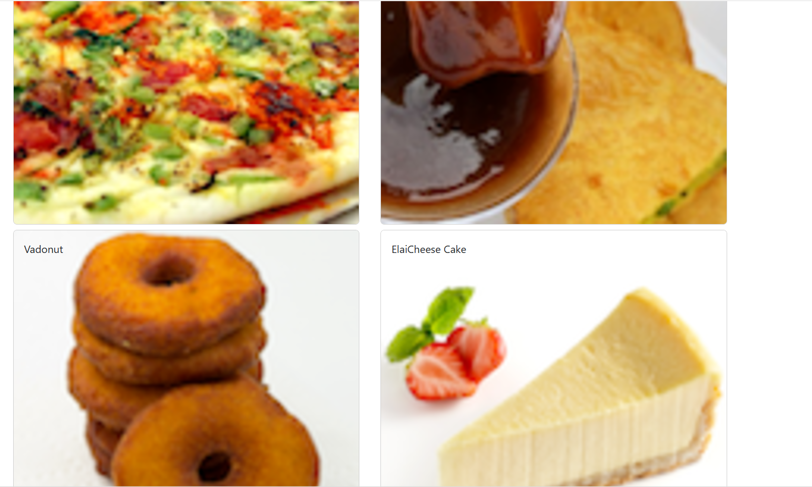

# Documentação de Componentes - Aula 10
 <h3> DIA: 26/11/2024 <h3>
    
 <h3>ALUNA: DÉBORA RAFAELLE SALES DE ANDRADE <h3>

---

Essa aula foi bem legal! Aprendemos a mexer com componentes em React e usar o `Card` para deixar tudo mais bonito. Vou explicar cada arquivo e o que fizemos de um jeito simples.

---

##  **MenuComponent.js**

Esse arquivo é onde criamos o menu. Ele mostra a lista de pratos e o detalhe de cada um. O que usamos aqui:

- **Imports:**  
  Usamos coisas como `Card`, `CardImg`, `CardBody` (do `reactstrap`) para criar os cartões bonitos.

- **Componentes:**  
  - `Menu` é o componente principal que mostra os pratos.  
  - O método `onDishSelect` serve para guardar o prato que foi clicado.  
  - O `renderDish` mostra os detalhes do prato escolhido (imagem, descrição, etc.).

- **Curiosidade:**  
  Usamos `props.dishes.map` para transformar a lista de pratos (`dishes`) em cartões na tela.

---

##  **dishes.js**

Esse arquivo tem os dados dos pratos, como se fosse o "cardápio". Aqui está o que tem:

- **Propriedades:**  
  Cada prato tem `id`, `name`, `image`, `category`, `label`, `price`, `description` e até **comentários** (uau!).

- **Tipo de dado:**  
  A data nos comentários segue o formato ISO, tipo `2012-10-16T17:57:28.556094Z`.

---

##  **App.js**

Esse é o coração do projeto, onde tudo se conecta. O que fizemos aqui:

- **`const [dishes]`:**  
  Criamos uma variável para guardar os pratos do arquivo `dishes.js`. Ela não muda, então usamos o `useState`.

- **Como funciona:**  
  O `<Menu dishes={dishes} />` passa a lista de pratos como "ingrediente" (props) para o componente `Menu`.

---

##  **O que mudou hoje?**

1. Adicionamos cartões para exibir os pratos de um jeito mais chique.
2. Agora dá para clicar em um prato e ver os detalhes dele.
3. Atualizamos o README para explicar essas mudanças.

---

##  **Minha parte favorita**

Trabalhar com comida me dá fome, mas foi divertido usar o `Card` para mostrar os pratos. Também gostei de brincar com o código e ver como tudo funciona. 

---
